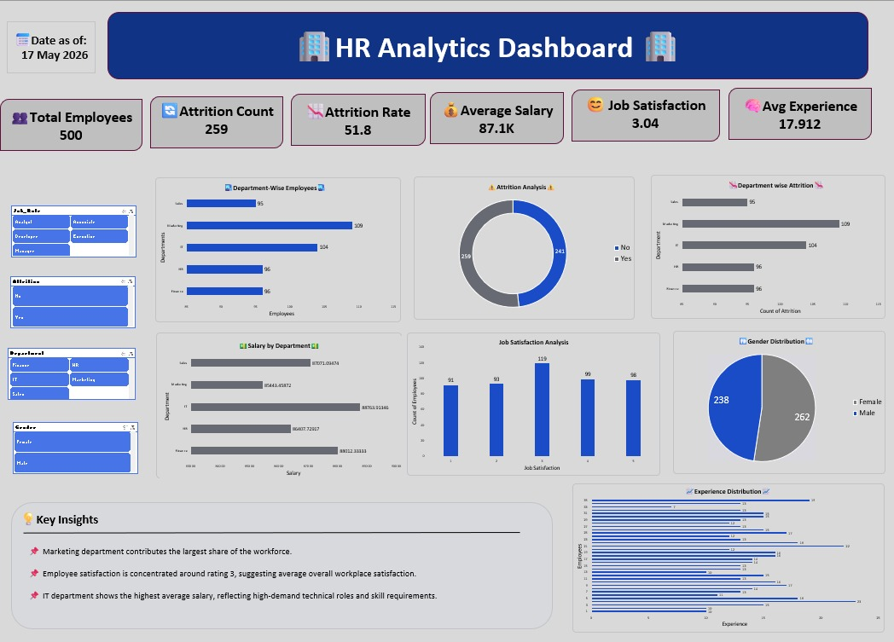

# HR-Analytics-Dashboard
HR Analytics Dashboard

📊 Overview

An interactive HR Analytics Dashboard created using Microsoft Excel to analyze employee performance, attrition trends, department-wise employee distribution, salary patterns, and job satisfaction.

The dashboard provides an interactive view of important HR metrics and helps identify key employee and organizational trends.

🎯 Objective

To analyze HR data and transform it into meaningful business insights using an interactive Excel dashboard.

🛠️ Tools Used

- Microsoft Excel
- Pivot Tables
- Pivot Charts
- Slicers
- KPI Cards
- Data Cleaning
- Data Visualization
- Dashboard Design

📌 Dashboard Features

- Total Employees
- Employee Attrition Analysis
- Department-wise Employee Analysis
- Average Salary Analysis
- Salary Distribution
- Employee Performance Analysis
- Job Satisfaction Analysis
- Attrition Rate Analysis
- Department-wise Attrition
- Employee Satisfaction Trends
- Interactive Filters

📈 Key Insights

- Marketing department contributes the largest share of employees.
- IT department recorded the highest average salary.
- Employee satisfaction was mostly concentrated around rating 3.
- Attrition rate remained high across departments.
- The dashboard provides an interactive view of employee and department-level HR trends.

💡 Skills Demonstrated

- Data Cleaning
- Data Analysis
- Data Visualization
- Dashboard Development
- Business Insights
- Microsoft Excel
- Pivot Tables & Pivot Charts
- Slicers
- KPI Development
- Interactive Dashboard Design

📷 Dashboard Preview

🚀 Learning Outcome

This project helped me improve my Excel analytics, dashboard development, data visualization, and business insight generation skills while working with HR-related data.

